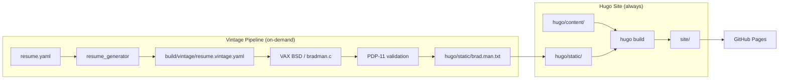

# Architecture

Companion docs:
- `README.md`
- `WORKFLOWS.md`
- `docs/integration/INDEX.md`

This repo is a Hugo-based personal site and technical writing portfolio. An optional vintage
build stage (VAX/PDP-11 via SIMH) generates a man-page resume as a technical artifact.

---

## Overview

Hugo owns the full site. The vintage pipeline is an on-demand artifact generator.

**Local publish pipeline:**
1. Author content in `hugo/content/`
2. `hugo --source hugo --destination site` → `site/`
3. GitHub Pages deployment via `publish-fast-*` tags

**Vintage publish pipeline (on-demand):**
1. `resume_generator` → `build/vintage/resume.vintage.yaml`
2. VAX/PDP-11 pipeline (SIMH on edcloud): `bradman.c` → `build/vintage/brad.1`
3. Host render: `brad.1` → `hugo/static/brad.man.txt`
4. Hugo build includes artifact at `/brad.man.txt`
5. GitHub Pages deployment via `publish-vintage-*` tags

---

## Pipeline (Diagram)



---

## Core components

### 1) Host generator (Python)
- Entry point: `resume-gen` (see `resume_generator/cli.py`)
- Reads `resume.yaml`, generates HTML/PDF, and prepares `resume.vax.yaml`.
- Renders `brad.1` into `site/brad.man.txt` for the landing page.

### 2) Vintage machine generator (C)
- Source: `vintage/machines/vax/bradman.c`
- Reads `resume.vintage.yaml`, produces a roff manpage (`brad.1`).
- Designed for 4.3BSD/K&R C compatibility.

### 3) Vintage stage runner
- `resume_generator/vintage_stage.py`
- Modes:
  - `local`: compile/run on host
  - `docker`: compile/run in SIMH 4.3BSD guest
  - `transcript`: replay stored console transcript
- Docker mode uses tape transfer by default.

### 4) ARPANET/integration context

- Multi-hop ARPANET paths are not part of active CI.
- Historical integration evidence remains under `docs/integration/`.

---

## Data formats

**Input**
- `resume.yaml` (human-edited)

**Derived**
- `build/vintage/resume.vintage.yaml` (simple YAML subset for the vintage C parser)
- `build/vintage/brad.1` (roff manpage source)
- `site/brad.man.txt` (rendered manpage summary)
- `site/vintage-build.log` (muted transcript)

### `resume.vax.yaml` contract (v1)

Host-produced; not committed. Rules exist so the guest C parser stays trivial.

**Encoding:**
- UTF-8, LF newlines, no tabs, 2-space indentation
- Mappings and sequences only — no anchors, tags, or aliases
- Scalars are single-line strings only (no `|`/`>` blocks); host flattens whitespace
- Strings are always double-quoted; `\` and `"` are escaped by the host
- First field: `schemaVersion: "v1"` (guest fails fast on mismatch)

**Required fields:** `schemaVersion`, `name`, `label`, `summary`

**Optional fields:** `contact.email`, `contact.url`, `contact.linkedin`

### `brad.1` transformation rules (v1)

Guest (`bradman.c`) produces roff `man(7)` source; host renders to `site/brad.man.txt`.

- `name` + `label` → `.TH` header + `NAME` section line (`brad \- <label>`), plus optional `AUTHOR`
- `summary` → `DESCRIPTION` section
- `contact.*` → `CONTACT` section
- Host render: wrap to 66 columns; `DESCRIPTION` truncated to 4 wrapped lines with `...`

**Escape rules (guest output):**
- Lines starting with `.` or `'` are prefixed with `\&` (troff zero-width escape)
- Backslashes are doubled; hyphen-minus in `NAME` synopsis uses `\-`

### Console protocol (v1)

Hard markers bracket the uuencode block in the telnet transcript:

```
<<<BRAD_1_UU_BEGIN>>>
uuencode brad.1 brad.1
<<<BRAD_1_UU_END>>>
```

Host decodes, writes `build/vax/brad.1`, then renders `site/brad.man.txt`. Decoder is tolerant of trailing garbage on lines (SIMH console occasionally appends noise).

---

## Runtime modes

### Local mode
```bash
.venv/bin/resume-gen --out site --with-vintage --vintage-mode local
```
- Compiles `bradman.c` on host
- No emulator needed


### Docker (SIMH) mode
```bash
.venv/bin/resume-gen --out site --with-vintage --vintage-mode docker
```
- Runs VAX 11/780 emulator
- 4.3BSD UNIX (1986)
- K&R C compiler
- TS11 tape transfer


### Production deployment (`publish-vintage*` tags)
- Single `t3a.medium` edcloud host (managed via `edcloud` CLI from sibling repo)
- Both VAX + PDP-11 containers on single Docker network (`docker-compose.production.yml`)
- Shared volume (`build-shared`) for artifact transfer between containers
- GitHub Actions workflow: SCP compose file → start containers → telnet consoles → retrieve artifacts


### Tag behavior
- `publish-fast-*`: Local mode (fast)
- `publish-vintage-*`: edcloud backend (authentic 4.3BSD + 2.11BSD pipeline)


### Notes
- Docker mode uses pinned SIMH image (`jguillaumes/simh-vaxbsd`)
- File transfer via TS11 tape image
- Production backend: single edcloud host with both VAX + PDP-11 containers
- Shared volume pattern enables console-based transfer preservation
- ARPANET multi-hop removed from CI (archived)


## Historical records

Historical implementation records are intentionally retained under `docs/integration/` and `docs/legacy/`.

---

## Outputs

**Published (in `site/`)**
- `site/index.html`
- `site/resume/`
- `site/resume.pdf`
- `site/brad.man.txt`
- `site/vintage-build.log`
- `site/arpanet-transfer.log` (when `--with-arpanet` is enabled)

**Internal (in `build/`)**
- `build/vintage/resume.vintage.yaml`
- `build/vintage/brad.1`
- `build/vintage/arpanet-transfer-exec.log` (execute mode scaffold output)

---

## CI/publish behavior

- `main` branch: runs checks only (no deploy).
- `publish-fast-*` / `publish-vintage-*` tags (and legacy alias wildcard tags): run full build + deploy to GitHub Pages.

---

## Next references

- `README.md` for quickstart commands.
- `CHANGELOG.md` (`[Unreleased]`) for current architecture and lifecycle boundary.
- `resume_generator/` for pipeline implementation.
