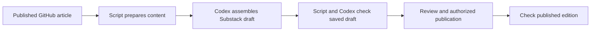

# Prepare and maintain a Substack edition

Implementation is unfinished and paused at Brad's request on September 12, 2026. The design and initial browser experiments are complete; no exporter, checker, tests, or reusable skill have been written. Brad authorized implementation and a local completion commit, then requested this unfinished handoff so another model can continue. Resume implementation when asked. This handoff was written without running tests or repeating validation.

Use the existing `codex/substack-workflow` worktree, at `/Users/brf/src/brfid-substack-workflow` on the owner's Mac. The plan was committed as `229e0b9`; merge `b51cea6` incorporated committed site work through `2acce26`, including the revised multihoming and Doc rot articles, AUTODIN II article, and crawler configuration. Preserve newer commits and uncommitted changes when resuming. At the last status read, the main checkout had an unfinished AUTODIN II article edit; this task did not change it.

Brad selected Codex on his Mac with access to the local script and browser, and rejected the RSS importer. Keep implementation in the public-site worktree; the private writing repository must contain no scripts. No site push, Substack publication, email delivery, or alteration of the existing published Substack editions occurred during the prototype.

## Resume from the browser prototype

The next bounded milestone is to prove repeated references and save/reopen behavior, then record the working procedure here before writing the full implementation. Browser experiments so far demonstrate individual operations, not a reliable complete transfer.

Use the installed browser skill and its current runtime documentation. Earlier runtime bindings and tabs may no longer be available. In Substack's publisher dashboard, find the existing draft titled **Substack transfer test — unpublished** instead of creating another test draft. Its post ID was not captured. Inspect the saved draft before resuming: the last observed editor contained a first native note with emphasis, a source link, and a second note paragraph; the attempted repeated reference had disappeared. The final insertion was not checked by reopening the draft.

### Observed behavior

- Bulk rich paste retained paragraphs, heading text, linked emphasis, labeled comparison blocks, and code-diagram text. The code experiment produced nested `<code>` elements; exact spacing was visible in the editor DOM, but this new prototype has not passed a complete saved-preview check.
- Native footnote anchors disappeared on bulk paste. This happened with generated native markup, with the editor's `data-pm-slice` attribute included, and with an exact native copy made through the editor's own copy and paste commands. Note text remained in a generic container. Do not repeat these same experiments without a specific new hypothesis.
- Pasting `<sup><a href="#footnote-1">1</a></sup>` before the native target existed also lost the reference. Repeated references are unresolved; ordinary fragment links cannot yet be assumed to survive.
- The editor's **More → Footnote** control inserted a native reference and a note, then focused the note content. Typing immediately or pasting formatted HTML at that focus worked. Clicking the More button again before typing stole focus; do not add that step.
- A single native note appeared in the preview with reference `href="#footnote-1"` and return link `href="#footnote-anchor-1"`. Actual navigation and persistence after reopening remain untested.
- A generated inline code placeholder could be selected exactly with ordinary mouse and keyboard actions, removed, and replaced with a native footnote. Rich note content then pasted correctly, including an emphasized phrase, a source link, and a second paragraph.
- Calling `fill('')` on the inline `<code>` placeholder failed with `Active element is no longer the expected input target: target token mismatch`. Filling the whole editor works but replaces its entire content. Use the precise selection procedure below for individual notes.

### Working individual-note insertion

Prepare the body with a unique marker at each note reference. The tested marker was `<code>SUBSTACK_NOTE_0001</code>`. Avoid collisions with article text. Do not treat markers as completed notes; the eventual checker must reject any remaining marker.

The following operations succeeded on macOS through the installed browser runtime. They are browser UI operations, not editor-state mutation. Here `tab` means the inspected prototype tab, obtained through the browser skill. Start with the marker visible in the current DOM:

```javascript
await tab.playwright.getByText('SUBSTACK_NOTE_0001', {exact: true}).click();
await tab.cua.keypress({keys: ['ALT', 'ARROWLEFT']});
await tab.cua.keypress({keys: ['ALT', 'SHIFT', 'ARROWRIGHT']});
const selected = await tab.playwright.evaluate(() => window.getSelection().toString());
if (selected !== 'SUBSTACK_NOTE_0001') throw new Error('Placeholder selection differs');
await tab.cua.keypress({keys: ['BACKSPACE']});
```

Inspect whether the **More** menu is open before clicking its button; it remains open after some interactions and a blind click can close it. Select **Footnote**. Without moving focus elsewhere, paste the note:

```javascript
await tab.clipboard.write([{entries: [{
  mimeType: 'text/html',
  text: '<p>A note with <em>emphasis</em> and a <a href="https://brfid.github.io/posts/multihoming/">source</a>.</p><p>Another note paragraph.</p>'
}]}]);
await tab.cua.keypress({keys: ['META', 'V']});
```

The observed body selector was `[data-testid="editor"]`, also exposed as a textbox named `Start writing...`. Use read-only DOM inspection to capture its content. Native references had class `footnote-anchor`, ID `footnote-anchor-1`, and destination `#footnote-1`; notes had class `footnote`, a number link with ID `footnote-1`, and a `footnote-content` container. These are observed selectors to confirm when resuming, not a public Substack API contract.

### Unresolved experiments and implementation

1. Test two references to one native note without duplicating the note content or losing either reference. A possible next experiment, not yet attempted, is to create the first native note, then use the editor's Link control to create a second numbered link to its observed destination. Verify the relationship in the saved and reopened draft and preview. If this fails, make the required content adaptation explicit before adopting it.
2. Prove image insertion from an existing published image URL or rich paste, including placement, alternative text, caption, and link. No image insertion has been attempted. Check built-in browser upload support before depending on it; use another supported browser route if necessary.
3. Finish the small prototype's save, reopen, note navigation, code spacing, and desktop/narrow preview checks. Table-to-labeled-block conversion remains a proposal supported only by a small manually supplied example.
4. Implement the deterministic preparation and comparison described below, then package the observed browser procedure as a reusable skill. Add destination identity, detection of independent edits, and resumable checkpoints. None of these components exists yet.
5. Run appropriate tests and complete-article acceptance checks after implementation, then make a scoped local completion commit. The instruction to skip tests applied to this documentation-only wrap-up; no passing implementation checks are claimed here. Publication and email remain separate from building the workflow.

For economical execution, the discussed recommendation was Sol high for the remaining bounded browser prototype, Sol medium for code, tests, skill, and ordinary fixes, and Astra high only for a specific unresolved failure. Brad has not yet selected or launched a replacement model. Preserve the full intended workflow while using concrete milestones to avoid repeating broad browser exploration.

## Reusable material

The previous exporter can be inspected read-only with `git show e253517:site_tools/substack.py` and `git show e253517:tests/test_substack.py`; it was later removed in `893f094`. Reuse extraction ideas, not its assumptions: it read built HTML and source metadata, made footnote links absolute to GitHub, and had no real Substack paste verification. Do not merge or restore old repository history wholesale.

The repository already has a Python environment in the main checkout and a pinned Hugo theme. The implementation worktree's theme was initialized. A temporary `.venv` symlink used during setup was removed when writing this handoff; follow the README for a checkout environment, or deliberately reuse the existing interpreter without committing an environment link.

Temporary local evidence may still exist; it is not part of the committed implementation. `/private/tmp/substack-current-multihoming.html` is the newer live-page snapshot, with 35 distinct notes and the latest non-adoption material. Earlier RSS-audit inputs are `/private/tmp/substack-audit-source-feed.xml`, `/private/tmp/substack-audit-source-multihoming.html`, `/private/tmp/substack-audit-source-docrot.html`, `/private/tmp/substack-audit-imported-multihoming.html`, and `/private/tmp/substack-audit-imported-docrot.html`. Their comparison reports are `/private/tmp/substack-audit-multihoming-comparison.json` and `/private/tmp/substack-audit-docrot-comparison.json`. Treat them as dated evidence, not current publication content; recover fresh inputs when implementation resumes if they are gone or stale.

## Intended routine

Ask Codex to prepare a published GitHub article for Substack. Codex runs the script, creates or revises the appropriate Substack draft, checks the saved result, and returns a preview with any remaining differences. Publishing, updating a live edition, and email delivery follow the authority given for that run; preparing a draft alone does not authorize those actions. Honor publication authority already given without asking again.



## What the script owns

Provide two operations, preparation and comparison, in one site module. Their command syntax will be documented after implementation.

Preparation fetches the live article, extracts its body and publication metadata, and saves the exact input with its URL, retrieval time, fingerprint, and converter version. It must not silently select a newer local draft or working-copy revision. The saved input can be reused without fetching a changed page.

Produce formatted content for bulk pasting and a structured manifest of paragraphs, headings, lists, tables, diagrams, images, source links, and notes. Give each note a stable identity and record every reference to it, including repeated references. The assistant uses those records to place content; it does not reconstruct the article from its own summary.

Keep preparation deterministic. Preserve wording, quotations, emphasis, link destinations, code spacing, and source provenance. Record every intended structural conversion so comparison can distinguish it from accidental loss. Reject unfamiliar structures with a specific explanation before changing a destination draft.

Comparison takes an export of the actual saved Substack body supplied by the browser workflow. Check content and relationships against the preparation manifest, including the correspondence between every note reference and its full note. Compare table cells and their row and column labels through the recorded conversion. Word counts alone are insufficient.

## What Codex owns

Use the existing browser skill and the signed-in Substack editor to find the destination, paste the prepared body, handle native controls, inspect previews, and export the saved result for comparison. Use supported UI interactions and clipboard operations. Do not make this depend on undocumented Substack write endpoints, copied session credentials, or direct mutation of editor internals.

Package the proven procedure as a small reusable Codex skill that calls the script. Keep the maintained copy with the public-site implementation; make it available from other projects through one user-level installation or symlink after the workflow is accepted. The ordinary request should not require Brad to run commands, copy each note, or repair the output.

## Content policies to prove

| Content | Proposed handling |
|---|---|
| Paragraphs, headings, lists, emphasis, and source links | Paste in bulk as formatted content. Strip site navigation and heading self-links; preserve intentional source links. |
| Footnotes | Use native Substack footnotes inserted through the Footnote control using the manifest; tested bulk pastes lost their anchors. The individual-placeholder method above is promising but not yet an accepted complete procedure. Test repeated references before choosing a numbering or reuse policy. Do not silently duplicate, omit, or redirect notes to GitHub. |
| Two-column tables | Convert each row to a labeled block, preserving its links and text. A bibliography becomes a sequence of source names and their linked descriptions. |
| Comparison grids | Retain the row heading and repeat each column heading before its cell. This is the proposed accessible default; it preserves both dimensions without depending on an HTML table. Complex spans or nested headers need a specific conversion decision. |
| Text diagrams | Keep code blocks and exact spacing. Both diagrams in the current multihoming post already render correctly on Substack. |
| Images | Preserve placement, alternative text, captions, and image links. Prove insertion from a published image URL or rich paste. If a local upload is required, use a browser route with verified upload support; do not assume the built-in browser can upload files. |
| Section links | Obtain Substack's actual section destinations after assembly, then verify intentional internal links. Do not retain source-site heading wrappers or invent fragments. |
| Dates | Preserve the intended publication calendar date and verify its displayed result. Retain the source timestamp separately; the RSS trial exposed a midnight-UTC date shift. |

Individual native insertion worked in the prototype. Repeated-reference reuse and successful saved-draft navigation remain prototype requirements; tested bulk footnote pastes failed.

## Existing editions and interrupted runs

Maintain one mapping from the canonical GitHub article URL to the verified Substack post ID and URL. Adopt the existing editions at `https://brfid.substack.com/p/multihoming` (post ID `215374173`) and `https://brfid.substack.com/p/doc-rot-maintenance-gap` (post ID `215374174`); ordinary updates must retain their identity. These identities were inspected during the audit; no mapping has been implemented yet.

Before modifying an existing edition, capture its current content and settings. Compare it with the last verified destination baseline and the new source. Surface independent Substack edits as a concrete diff before overwriting them. An unchanged source and matching destination should produce no write.

Keep the latest verified baseline and any in-progress checkpoint in a dedicated local data directory outside outputs removed by `make clean`. Record source fingerprint, target identity, and verified progress. After an interruption or uncertain save, read the existing draft before resuming; do not create another draft or repeat insertions on assumption. Capture enough of the previous target to prepare a restoration if needed.

Recheck the source and destination for changes before publishing an already reviewed draft. After an authorized publication or update, check the actual public edition and record the verified result. Treat sending email as a distinct delivery choice; do not resend merely because an article was revised.

## Implementation sequence

1. In an unpublished prototype, test a representative paragraph, linked emphasis, one long note, repeated references to that note, a comparison-grid conversion, a code diagram, and an image. Test save, reopen, preview, and actual note navigation. Prefer bulk transfer when it passes; retain native editor steps for elements that need them.
2. Implement preparation and comparison from those observed results. Reuse the useful extraction ideas from the previous exporter, with explicit content mappings and checks for the failures observed in the RSS trial.
3. Add the reusable Codex procedure, destination mapping, and resumable checkpoints. Prove that repeating an unchanged run does not duplicate posts or notes, and that independent destination edits are detected.
4. Prepare complete drafts from both current published articles and repair every failed check. Only then use the workflow to replace the damaged imported editions under the authority given for that run.

The first prototype determines feasibility. Do not build out a large automation around unproven footnote behavior or leave routine formatting repairs for Brad as the success condition. If work on long posts becomes slow or unreliable, revisit bulk native-footnote transfer before expanding the browser procedure. Reconsider the browser adapter if a supported Substack publishing interface becomes available; keep preparation and comparison reusable.

## Acceptance evidence

The September 12 RSS trial transferred all normalized article and note text and all non-fragment link destinations. It flattened three tables and left 78 note-reference and return links without destinations. The multihoming feed also omitted the site's generated Notes heading. These are concrete regression cases, not a reason to reject preserved content.

The original audit examples had 28 distinct notes, two tables, and two text diagrams in multihoming, and three notes and one comparison grid in Doc rot. Both articles have since changed: the newer live multihoming snapshot has 35 distinct notes, and the revised Doc rot article has been committed and published. Re-inventory the exact published snapshots selected for acceptance; do not use the older counts as current requirements. Verify full content, including recent changes, rather than only searching for selected phrases.

Acceptance requires a saved and reopened draft with complete text, correct note relationships and working navigation, readable table conversions with all labels and links, intact diagrams, and correct title and displayed date. Visually inspect desktop and narrow previews. After publication is separately authorized, repeat the check on the public page. Browser verification is necessary even when the repository's automated checks pass.

## References

- [OpenAI: Build skills](https://learn.chatgpt.com/docs/build-skills) describes reusable instructions, resources, scripts, and local skill discovery.
- [OpenAI: Browser](https://learn.chatgpt.com/docs/browser) describes browser interaction and its upload limitations; installed browser capabilities must also be checked when implementing.
- [Site workflow and publication constraints](../AGENTS.md) govern implementation, local checkpoints, and publication.
