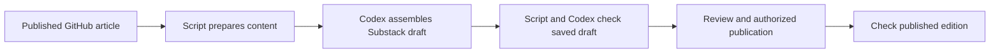

# Prepare and maintain a Substack edition

Design proposal for a script and a Codex workflow. Implementation and publication are not authorized by this document alone. Work takes place in a separate worktree of this site repository. Brad has selected Codex on his Mac, with access to the local script and browser, and rejected the RSS importer.

## Intended routine

Ask Codex to prepare a published GitHub article for Substack. Codex runs the script, creates or revises the appropriate Substack draft, checks the saved result, and returns a preview with any remaining differences. Publishing, updating a live edition, and email delivery follow the authority given for that run; preparing a draft alone does not authorize those actions. Honor publication authority already given without asking again.

## What the script owns

Provide two operations, preparation and comparison, in one site module. Their command syntax will be documented after implementation.

Preparation fetches the live article, extracts its body and publication metadata, and saves the exact input with its URL, retrieval time, fingerprint, and converter version. It must not silently select a newer local draft or working-copy revision. The saved input can be reused without fetching a changed page.

Produce formatted content for bulk pasting and a structured manifest of paragraphs, headings, lists, tables, diagrams, images, source links, and notes. Give each note a stable identity and record every reference to it, including repeated references. The assistant uses those records to place content; it does not reconstruct the article from its own summary.

Keep preparation deterministic. Preserve wording, quotations, emphasis, link destinations, code spacing, and source provenance. Record every intended structural conversion so comparison can distinguish it from accidental loss. Reject unfamiliar structures with a specific explanation before changing a destination draft.

Comparison takes an export of the actual saved Substack body supplied by the browser workflow. Check content and relationships against the preparation manifest, including the correspondence between every note reference and its full note. Compare table cells and their row and column labels through the recorded conversion. Word counts alone are insufficient.

## What Codex owns

Use the existing browser skill and the signed-in Substack editor to find the destination, paste the prepared body, handle native controls, inspect previews, and export the saved result for comparison. Use supported UI interactions and clipboard operations. Do not make this depend on undocumented Substack write endpoints, copied session credentials, or direct mutation of editor internals.

Package the proven procedure as a small reusable Codex skill that calls the script. Keep the maintained copy with the public-site implementation; make it available from other projects through one user-level installation or symlink after the workflow is accepted. The ordinary request should not require Brad to run commands, copy each note, or repair the output.

## Content policies to prove

| Content | Proposed handling |
|---|---|
| Paragraphs, headings, lists, emphasis, and source links | Paste in bulk as formatted content. Strip site navigation and heading self-links; preserve intentional source links. |
| Footnotes | Prefer native Substack footnotes. First test whether authentic native footnotes survive a prepared bulk paste. If they do not, Codex inserts them with the Footnote control using the manifest. Test repeated references before choosing a numbering or reuse policy. Do not silently duplicate, omit, or redirect notes to GitHub. |
| Two-column tables | Convert each row to a labeled block, preserving its links and text. A bibliography becomes a sequence of source names and their linked descriptions. |
| Comparison grids | Retain the row heading and repeat each column heading before its cell. This is the proposed accessible default; it preserves both dimensions without depending on an HTML table. Complex spans or nested headers need a specific conversion decision. |
| Text diagrams | Keep code blocks and exact spacing. Both diagrams in the current multihoming post already render correctly on Substack. |
| Images | Preserve placement, alternative text, captions, and image links. Prove insertion from a published image URL or rich paste. If a local upload is required, use a browser route with verified upload support; do not assume the built-in browser can upload files. |
| Section links | Obtain Substack's actual section destinations after assembly, then verify intentional internal links. Do not retain source-site heading wrappers or invent fragments. |
| Dates | Preserve the intended publication calendar date and verify its displayed result. Retain the source timestamp separately; the RSS trial exposed a midnight-UTC date shift. |

The native Footnote control is present in the current editor. Its presence does not yet establish reliable bulk pasting, repeated-reference reuse, or successful saved-draft navigation. Those are prototype requirements.

## Existing editions and interrupted runs

Maintain one mapping from the canonical GitHub article URL to the verified Substack post ID and URL. Adopt the existing editions at `https://brfid.substack.com/p/multihoming` and `https://brfid.substack.com/p/doc-rot-maintenance-gap`; ordinary updates must retain their identity.

Before modifying an existing edition, capture its current content and settings. Compare it with the last verified destination baseline and the new source. Surface independent Substack edits as a concrete diff before overwriting them. An unchanged source and matching destination should produce no write.

Keep the latest verified baseline and any in-progress checkpoint in a dedicated local data directory outside outputs removed by `make clean`. Record source fingerprint, target identity, and verified progress. After an interruption or uncertain save, read the existing draft before resuming; do not create another draft or repeat insertions on assumption. Capture enough of the previous target to prepare a restoration if needed.

Recheck the source and destination for changes before publishing an already reviewed draft. After an authorized publication or update, check the actual public edition and record the verified result. Treat sending email as a distinct delivery choice; do not resend merely because an article was revised.

## Implementation sequence

1. In an unpublished prototype, test a representative paragraph, linked emphasis, one long note, repeated references to that note, a comparison-grid conversion, a code diagram, and an image. Test save, reopen, preview, and actual note navigation. Prefer bulk transfer when it passes; retain native editor steps for elements that need them.
2. Implement preparation and comparison from those observed results. Reuse the useful extraction ideas from the previous exporter, with explicit content mappings and checks for the failures observed in the RSS trial.
3. Add the reusable Codex procedure, destination mapping, and resumable checkpoints. Prove that repeating an unchanged run does not duplicate posts or notes, and that independent destination edits are detected.
4. Prepare complete drafts from both current published articles and repair every failed check. Only then use the workflow to replace the damaged imported editions under the authority given for that run.

The first prototype determines feasibility. Do not build out a large automation around unproven footnote behavior or leave routine formatting repairs for Brad as the success condition. If work on long posts becomes slow or unreliable, revisit bulk native-footnote transfer before expanding the browser procedure. Reconsider the browser adapter if a supported Substack publishing interface becomes available; keep preparation and comparison reusable.

## Acceptance evidence

The September 12 RSS trial transferred all normalized article and note text and all non-fragment link destinations. It flattened three tables and left 78 note-reference and return links without destinations. The multihoming feed also omitted the site's generated Notes heading. These are concrete regression cases, not a reason to reject preserved content.

Use the current published articles as complete examples: multihoming has 28 distinct notes, repeated references, two tables, two text diagrams, and the September 10 CIGALE measurement and source-download additions; Doc rot has three notes and one comparison grid. Verify the full content rather than only searching for those recent additions.

Acceptance requires a saved and reopened draft with complete text, correct note relationships and working navigation, readable table conversions with all labels and links, intact diagrams, and correct title and displayed date. Visually inspect desktop and narrow previews. After publication is separately authorized, repeat the check on the public page. Browser verification is necessary even when the repository's automated checks pass.

## References

- [OpenAI: Build skills](https://learn.chatgpt.com/docs/build-skills) describes reusable instructions, resources, scripts, and local skill discovery.
- [OpenAI: Browser](https://learn.chatgpt.com/docs/browser) describes browser interaction and its upload limitations; installed browser capabilities must also be checked when implementing.
- [Site workflow and publication constraints](../AGENTS.md) govern implementation, local checkpoints, and publication.
