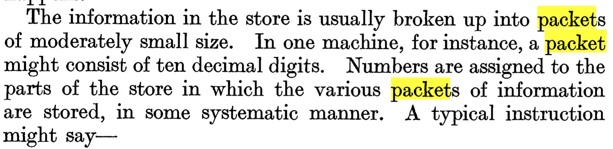
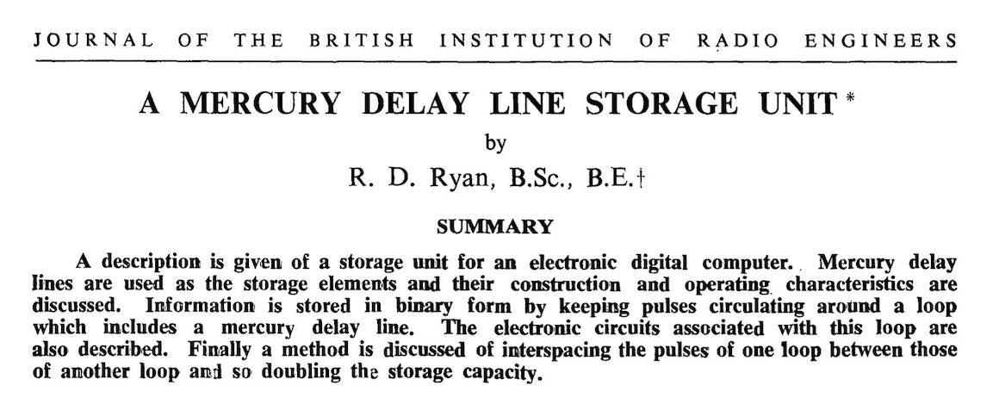
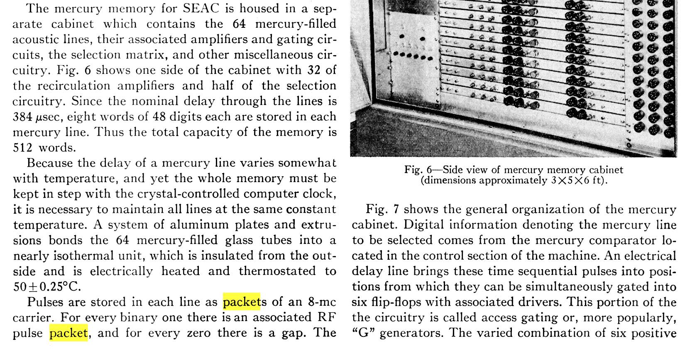

Donald Davies helped establish _packet_ in computer networking in the 1960s. He recalled choosing the word after consulting Steve Whelan, a linguist on their machine translation project, "at least partly because of its ease of translation."

But the term appears in computing earlier.

At the National Physical Laboratory (NPL), Davies worked alongside Alan Turing. Turing used _packet_ to describe a discrete data structure in [Computing Machinery and Intelligence](https://doi.org/10.2307/2251299) (_Mind_ 59/236, 1950):

He wrote that paper before leaving NPL in 1948, placing the word in computing before its networking adoption.

The most plausible path into computing is from the _wave packet_ vocabulary in physics. Early digital computers used delay-line memory, developed in the mid-1940s. Researchers writing about these systems used _packet_ to describe discrete data signals:

And again in Sidney Greenwald's 1953 _Proceedings of the IRE_ paper on the SEAC:

Turing joined NPL in 1945 to design the Automatic Computing Engine (ACE), which used delay-line memory. His [1946 ACE design report](https://archive.org/details/amturingsacerepo00turi) doesn't use the word _packet_, but it may appear elsewhere in ACE materials.

Most likely _packet_ entered computing through delay-line physics and was already in use before networking work standardized it. Turing reflects an early computing instance of the word; Davies is a major contributor to packet-switching practice and language, not its sole origin.
