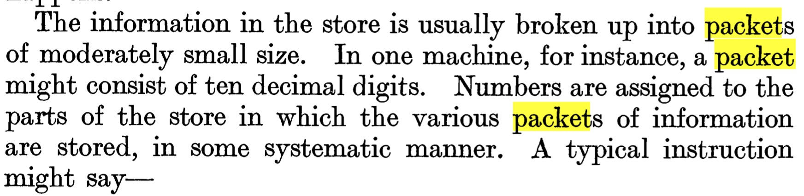
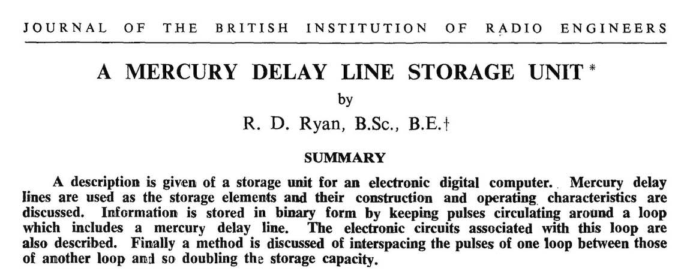
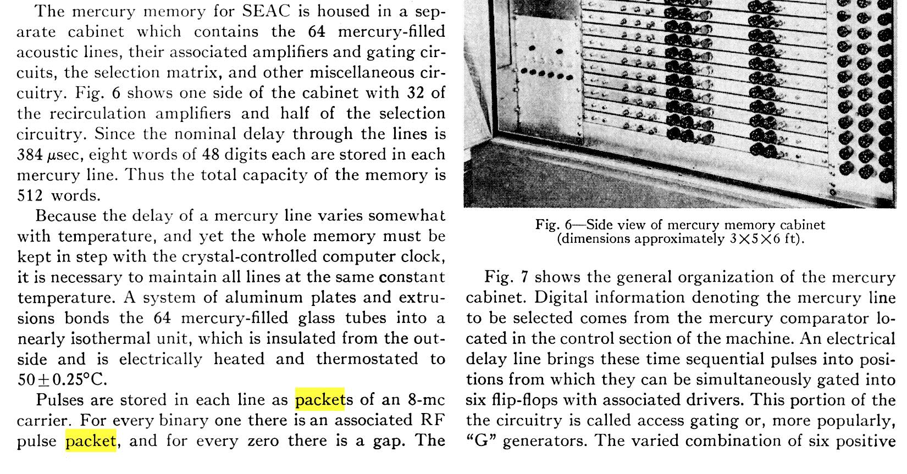

Alan Turing used the term _packet_ to refer to a fixed-length (but not necessarily
uniform) data structure used to organize larger bodies of information for computation.
You can see it in [Computing Machinery and Intelligence](https://doi.org/10.2307/2251299)
(_Mind_ 59/236):

He wrote the paper [before leaving](http://www.alanturing.net/turing_archive/archive/l/l32/l32.php)
the National Physical Laboratory (NPL) in 1948, where he worked alongside
[Donald Davies](https://en.wikipedia.org/wiki/Donald_Davies). Davies later introduced
_packet_ into computer networking to mean what we now call packets (as distinct from
datagrams). In the standard networking origin story, [this is where things begin](https://www.wired.com/2012/09/donald-davies/).

Davies recalled that "after discussion with a linguist working on our Russian to
English machine translation project, Steve Whelan, I decided on the word 'packet',"
at least partly because of its ease of translation.

It seems more likely that Turing did not coin the term so much as inherit local usage
at NPL. If so, where did that usage come from? Davies may simply have chosen from a
list of semantically appropriate words, but there is another plausible path.

One good candidate is the _wave packet_ from [physics](https://en.wikipedia.org/wiki/Wave_packet).
Some of the first digital computers used delay-line memory, invented in the mid-1940s
and implemented in early systems such as EDVAC and UNIVAC (core memory did not arrive
until the mid-1950s). Researchers working on these systems referred to packet
_phenomena_ in the lines, and it is not a big leap to imagine the term becoming
associated with discrete units of information.

At NPL, Turing was designing the Automatic Computing Engine (ACE), a stored-program
computer that used delay-line memory. He joined NPL in 1945 and published his ACE
design report in [1946](https://archive.org/details/amturingsacerepo00turi), which does
not use the word _packet_. I have not worked through all the ACE materials, so the term
may still appear elsewhere.

Nonetheless, you can see the association in papers like this:

And also in this 1953 _Proceedings of the IRE_ paper by Sidney Greenwald, documenting
a first-generation digital computer, the SEAC:

(I tweeted a shorter version of this years ago, then deleted my social media accounts.
This post is the fuller archival version, with the extra wave-packet context.)
